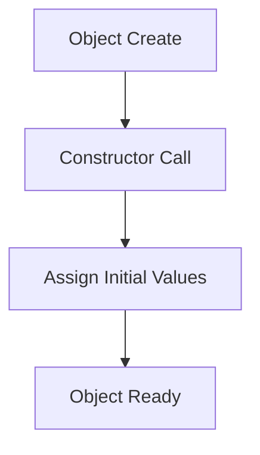
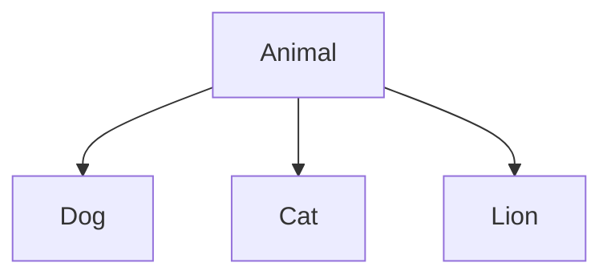
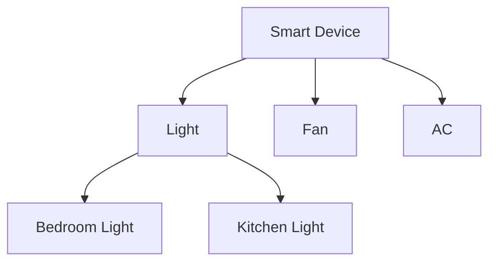

# Kotlin OOP Ultimate Master Guide
## Classes, Objects, Constructors, Inheritance, Polymorphism, Abstraction & More

> Goal of This Documentation:
>
> Ye guide itni deeply aur simply explain karegi ki:
>
> - Agar tum beginner ho → tab bhi samajh jaoge
> - Agar tum future me revise karoge → ek baar me yaad aa jayega
> - Agar tum interview doge → concepts crystal clear honge
> - Agar tum Android ya Software Development karoge → foundation strong hoga

---

# Table of Contents

1. [Introduction](#introduction)
2. [What is Programming Paradigm?](#what-is-programming-paradigm)
3. [What is OOP?](#what-is-oop)
4. [Real World Understanding of OOP](#real-world-understanding-of-oop)
5. [What is a Class?](#what-is-a-class)
6. [What is an Object?](#what-is-an-object)
7. [Difference Between Class and Object](#difference-between-class-and-object)
8. [Creating Your First Class](#creating-your-first-class)
9. [Properties and Functions](#properties-and-functions)
10. [Constructors in Kotlin](#constructors-in-kotlin)
11. [Primary Constructor](#primary-constructor)
12. [Secondary Constructor](#secondary-constructor)
13. [Constructor Flow](#constructor-flow)
14. [Parent Class and Child Class](#parent-class-and-child-class)
15. [Superclass and Subclass](#superclass-and-subclass)
16. [Inheritance in Kotlin](#inheritance-in-kotlin)
17. [Relationship Between Classes](#relationship-between-classes)
18. [IS-A vs HAS-A Relationship](#is-a-vs-has-a-relationship)
19. [Polymorphism](#polymorphism)
20. [Function Overriding](#function-overriding)
21. [Encapsulation](#encapsulation)
22. [Abstraction](#abstraction)
23. [Visibility Modifiers](#visibility-modifiers)
24. [Delegate and by Keyword](#delegate-and-by-keyword)
25. [Smart Home Real World Example](#smart-home-real-world-example)
26. [Final Complete Example](#final-complete-example)
27. [Final Revision Table](#final-revision-table)
28. [Conclusion](#conclusion)

---

# Introduction

Kotlin ek modern programming language hai jo mainly:
- Android Development
- Backend Systems
- Desktop Apps
- Enterprise Applications

banane ke liye use hoti hai.

Kotlin ka sabse important topic hai:

## Object Oriented Programming (OOP)

Agar OOP strong hai:
✅ Coding easy lagegi  
✅ Real-world systems samajh aaenge  
�� Large applications banana easy hoga  

Agar OOP weak hai:
❌ Complex systems confusing lagenge  
❌ Architecture samajhna mushkil hoga  

---

# What is Programming Paradigm?

Programming Paradigm ka matlab hota hai:

> "Programming karne ka style ya approach."

Different paradigms:
- Procedural Programming
- Functional Programming
- Object Oriented Programming
- Declarative Programming

Kotlin multiple paradigms support karta hai,
but sabse commonly:

## OOP

use hota hai.

---

# What is OOP?

## Technical Definition

> Object Oriented Programming (OOP) ek programming paradigm hai jisme software ko objects ke form me design aur organize kiya jata hai.

---

## Simplified Definition

> OOP ka matlab:
>
> Real-world cheezo ko programming objects ki form me represent karna.

---

## Real World Example

Real world me:
- Car
- Mobile
- Student
- Bank Account
- Camera

sabke:
- properties hoti hain
- behaviors hote hain

Programming me bhi hum exactly same idea use karte hain.

---

## Example

### Car

#### Properties
- color
- speed
- brand

#### Behaviors
- start()
- brake()
- accelerate()

Programming me:
```kotlin
class Car
```

ban sakta hai.

---

## Main Goal of OOP

OOP ka main goal:
- code reusable banana
- code organized banana
- real-world modeling karna
- complexity reduce karna

---

# Real World Understanding of OOP

Imagine:
Tum ek Smart City bana rahe ho.

Usme:
- cars
- buildings
- traffic lights
- cameras
- people

sab different entities hain.

Agar sabko random variables me handle karoge:
❌ impossible ho jayega.

Isliye:
hum har entity ko:
```text
Object
```
banate hain.

Aur us object ka design:
```text
Class
```
ke through define karte hain.

---

# What is a Class?

## Technical Definition

> Class ek blueprint/template hota hai jo objects ki structure aur behavior define karta hai.

---

## Simplified Definition

> Class ek design hota hai jisse objects bante hain.

---

## Real Life Analogy

### Blueprint Example

Architect ghar banane se pehle:
ek blueprint banata hai.

Blueprint define karta hai:
- rooms
- doors
- kitchen
- windows

But:
⚠ Blueprint actual ghar nahi hota.

Wo sirf:
```text
design
```

hota hai.

Programming me:
```text
Class = Blueprint
```

---

## Syntax

```kotlin
class Student {

}
```

Abhi:
- koi real student nahi bana
- sirf design create hua

---

# What is an Object?

## Technical Definition

> Object class ka runtime instance hota hai jo actual data aur behavior hold karta hai.

---

## Simplified Definition

> Object class ka real usable version hota hai.

---

## Real Life Example

Blueprint se jab actual ghar ban jaye:

wo:
```text
Object
```

hai.

---

## Example

```kotlin
val student1 = Student()
```

Yaha:
```kotlin
student1
```

actual object hai.

---

# Difference Between Class and Object

| Class | Object |
|---|---|
| Blueprint | Actual instance |
| Design | Real thing |
| Memory nahi leta | Memory leta |
| Logical entity | Physical entity |

---

## Memory Understanding

Class:
❌ memory occupy nahi karti directly

Object:
✅ runtime me memory leta hai

---

# Creating Your First Class

```kotlin
class Student {

    var name = "Subh"

    fun study(){
        println("Studying...")
    }

}
```

---

# Properties and Functions

---

## Property

### Definition

> Variable jo class ke andar hota hai.

---

### Simplified

> Object ka data.

---

### Example

```kotlin
var name = "Subh"
```

---

## Function

### Definition

> Function object ka behavior define karta hai.

---

### Simplified

> Object kya kaam karega.

---

### Example

```kotlin
fun study(){
    println("Studying...")
}
```

---

# Constructors in Kotlin

## Technical Definition

> Constructor ek special function hota hai jo object creation ke time automatically call hota hai.

---

## Simplified Definition

> Constructor object ko initial values dene ke liye use hota hai.

---

## Purpose of Constructor

Constructor ka purpose:
- object initialize karna
- initial setup karna
- values assign karna

---

# Primary Constructor

---

## Syntax

```kotlin
class Student(val name: String)
```

---

## Object Creation

```kotlin
val s1 = Student("Subh")
```

---

## Understanding

Jab object create hua:
constructor automatically run hua.

---

# Constructor Flow



---

# Secondary Constructor

Kotlin multiple constructors allow karta hai.

---

## Example

```kotlin
class Student {

    var name: String
    var age: Int

    constructor(name: String, age: Int){
        this.name = name
        this.age = age
    }

}
```

---

# Parent Class and Child Class

Ye inheritance ka core concept hai.

---

## Parent Class

### Definition

> Wo class jisse dusri class inherit karti hai.

---

### Simplified

> Common features dene wali class.

---

## Child Class

### Definition

> Wo class jo parent class ki properties/functions inherit karti hai.

---

### Simplified

> Parent ki abilities use karne wali class.

---

### Example

```kotlin
open class Animal {

    fun eat(){
        println("Eating...")
    }

}
```

---

## Child Class

```kotlin
class Dog : Animal()
```

---

# Superclass and Subclass

| Term | Meaning |
|---|---|
| Superclass | Parent class |
| Subclass | Child class |

---

# Relationship Flow



---

# Inheritance in Kotlin

## Technical Definition

> Inheritance ek mechanism hai jisme ek class dusri class ki properties aur behaviors acquire karti hai.

---

## Simplified Definition

> Ek class dusri class ki powers use karti hai.

---

## Purpose of Inheritance

Inheritance:
- code reuse karta hai
- repeated code kam karta hai
- maintainability improve karta hai

---

## Example

```kotlin
open class Animal {

    fun eat(){
        println("Eating...")
    }

}

class Dog : Animal()
```

---

# Relationship Between Classes

---

## Parent → Child

Parent:
- common features provide karta hai

Child:
- specialized behavior add karta hai

---

## Real Life Example

```text
Vehicle
 ├── Car
 ├── Bike
 └── Truck
```

Sab vehicles:
- move karte hain
- speed rakhte hain

Toh common features:
```text
Vehicle
```
me define kiye gaye.

---

# IS-A vs HAS-A Relationship

---

## IS-A Relationship

Inheritance represent karta hai.

Example:

```text
Dog IS-A Animal
```

---

## HAS-A Relationship

Composition represent karta hai.

Example:

```text
Car HAS-A Engine
```

---

## Difference

| IS-A | HAS-A |
|---|---|
| Inheritance | Composition |
| Parent-child relation | Ownership relation |

---

# Polymorphism

## Technical Definition

> Polymorphism ek concept hai jisme same interface/function multiple forms me behave karta hai.

---

## Simplified Definition

> Same cheez different behavior dikhati hai.

---

## Example

```kotlin
open class Animal {

    open fun sound(){
        println("Animal Sound")
    }

}
```

---

## Child Classes

```kotlin
class Dog : Animal(){

    override fun sound(){
        println("Bark")
    }

}

class Cat : Animal(){

    override fun sound(){
        println("Meow")
    }

}
```

---

## Understanding

Same function:
```kotlin
sound()
```

Different outputs de raha hai.

Ye:
## Polymorphism

hai.

---

# Function Overriding

## Definition

> Child class parent function ko modify kar sakti hai.

---

## Simplified

> Existing behavior ko customize karna.

---

## Example

```kotlin
override fun sound()
```

---

# Encapsulation

## Technical Definition

> Data aur methods ko ek single unit/class me wrap karna encapsulation kehlata hai.

---

## Simplified Definition

> Related cheezo ko ek box/class ke andar rakhna.

---

## Example

```kotlin
class BankAccount {

    private var balance = 1000

    fun deposit(amount: Int){
        balance += amount
    }

}
```

---

# Abstraction

## Technical Definition

> Internal implementation details ko hide karke sirf essential features expose karna abstraction kehlata hai.

---

## Simplified Definition

> User ko sirf important cheez dikhana.

---

## Real Life Example

Camera use karte waqt:
tum:
- sensor physics
- image processing

nahi dekhte.

Sirf:
```text
Capture Button
```
use karte ho.

---

# Visibility Modifiers

Visibility modifiers decide karte hain:
> kaun access kar sakta hai.

---

## Types

| Modifier | Access |
|---|---|
| public | everywhere |
| private | same class |
| protected | class + subclass |
| internal | same module |

---

## private Example

```kotlin
private var password = "1234"
```

Outside access:
❌ not possible

---

## Why Visibility Modifiers Important?

Because:
- security
- encapsulation
- controlled access

provide karte hain.

---

# Delegate and by Keyword

Delegate reusable logic provide karta hai.

---

## Example

```kotlin
val name by lazy {
    "Subh"
}
```

---

## Meaning

Value tab create hogi:
> jab first time use hogi.

---

# Smart Home Real World Example

Imagine:
```text
Smart Home App
```

Classes:
- Light
- Fan
- AC

Objects:
- Bedroom Light
- Hall AC

---

# Structure Flow



---

# Final Complete Example

```kotlin
open class Animal(val name: String){

    open fun sound(){
        println("Animal Sound")
    }

    fun eat(){
        println("$name is eating")
    }

}

class Dog(name: String) : Animal(name){

    override fun sound(){
        println("$name says Bark")
    }

}

fun main(){

    val dog1 = Dog("Tommy")

    dog1.sound()

    dog1.eat()

}
```

---

# Final Revision Table

| Concept | Meaning |
|---|---|
| Class | Blueprint |
| Object | Real Instance |
| Constructor | Initializes object |
| Parent Class | Base class |
| Child Class | Derived class |
| Superclass | Parent |
| Subclass | Child |
| Inheritance | Reusing parent features |
| Polymorphism | Same method, different forms |
| Encapsulation | Wrapping data + methods |
| Abstraction | Hiding complexity |
| Visibility Modifiers | Access control |

---

# Conclusion

Agar tumne ye pura documentation deeply samajh liya:

toh tum:
- OOP
- Classes
- Objects
- Constructors
- Inheritance
- Polymorphism
- Abstraction
- Encapsulation

deeply samajh jaoge.

Aur future me:
- Android Development
- Backend
- Software Architecture

bahut easy lagne lagega

---

# Golden Final Line

> OOP real-world cheezo ko software objects me convert karne ka art hai.

---
