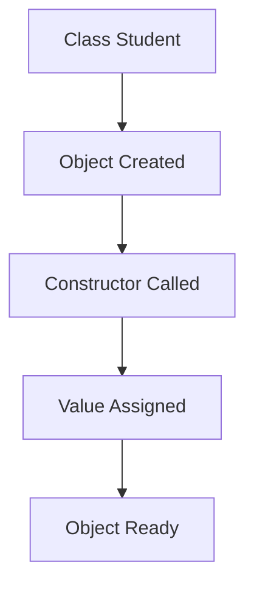
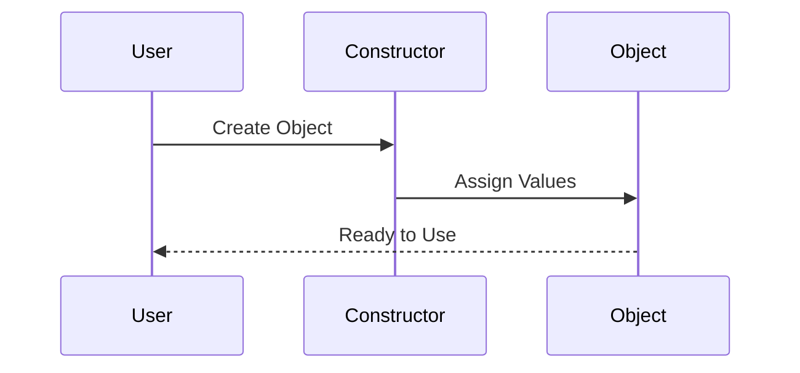
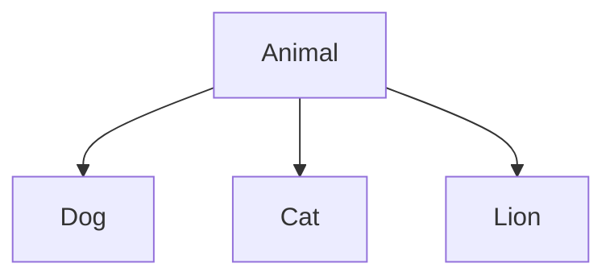
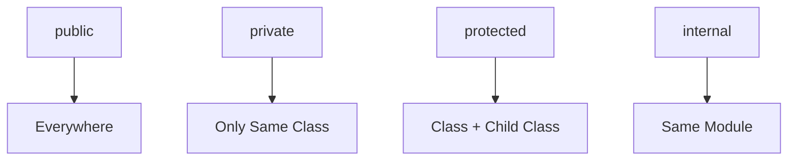
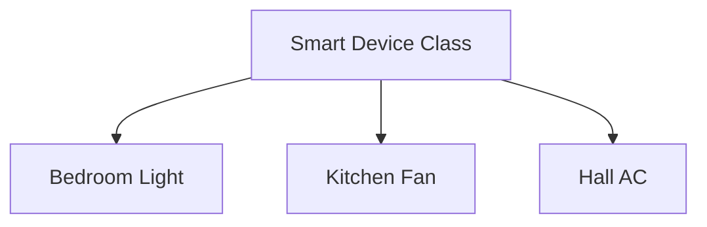

# 🟣 Kotlin Classes & Objects Ultimate Master Guide
## From Zero to Deep OOP Understanding 🚀

> Ye documentation future-proof way me likha gaya hai.
> Agar tum ise 10 saal baad bhi kholo,
> toh sirf ek baar padhkar Classes aur Objects deeply samajh jaoge.

---

# 📚 Table of Contents

- [📌 Introduction](#-introduction)
- [🧠 What is OOP?](#-what-is-oop)
- [🏠 Real Life Analogy](#-real-life-analogy)
- [🔥 What is a Class?](#-what-is-a-class)
- [🔥 What is an Object?](#-what-is-an-object)
- [🟣 Creating Your First Class](#-creating-your-first-class)
- [🟢 Creating Objects](#-creating-objects)
- [📦 Properties and Functions](#-properties-and-functions)
- [🏗 Constructors in Kotlin](#-constructors-in-kotlin)
- [🟡 Primary Constructor](#-primary-constructor)
- [🟠 Secondary Constructor](#-secondary-constructor)
- [🧠 Constructor Flow](#-constructor-flow)
- [👨‍👦 Parent Class and Child Class](#-parent-class-and-child-class)
- [🧬 Superclass and Subclass](#-superclass-and-subclass)
- [🔗 Relationship Between Parent and Child](#-relationship-between-parent-and-child)
- [🟣 Inheritance in Kotlin](#-inheritance-in-kotlin)
- [🟢 IS-A vs HAS-A Relationship](#-is-a-vs-has-a-relationship)
- [🎭 Polymorphism](#-polymorphism)
- [🔄 Function Overriding](#-function-overriding)
- [📦 Encapsulation](#-encapsulation)
- [🎭 Abstraction](#-abstraction)
- [🔐 Visibility Modifiers](#-visibility-modifiers)
- [🧠 Delegate and by Keyword](#-delegate-and-by-keyword)
- [🏠 Smart Home Real World Project Structure](#-smart-home-real-world-project-structure)
- [📌 Complete Final Example](#-complete-final-example)
- [🧠 Final Revision Notes](#-final-revision-notes)
- [🏁 Conclusion](#-conclusion)

---

# 📌 Introduction

Kotlin ek modern programming language hai jo:
- Android Development
- Backend Development
- Desktop Apps
- Scalable Software Systems

banane ke liye use hoti hai.

Kotlin ka sabse important concept hai:

# 🔥 Object Oriented Programming (OOP)

Aur OOP ka foundation hai:

- Classes
- Objects
- Inheritance
- Encapsulation
- Polymorphism
- Abstraction

Agar ye concepts clear ho gaye,
toh advanced development easy lagne lagega.

---

# 🧠 What is OOP?

OOP ka full form:

```text
Object Oriented Programming
```

---

# 🎯 OOP Ka Main Goal

Real-world problems ko:
- objects
- classes
- behaviors

ke form me represent karna.

---

# 📱 Real Life Example

Tumhara mobile phone:

contains:
- camera
- speaker
- battery
- display
- apps

Sab alag objects ki tarah work karte hain.

OOP bhi exactly same idea follow karta hai.

---

# 🏠 Real Life Analogy

Imagine tum ek ghar bana rahe ho.

---

# 🟣 Blueprint

Architect ek design banata hai.

Usme:
- rooms
- kitchen
- bathroom
- windows

sab defined hota hai.

But:
⚠ Ye actual ghar nahi hota.

---

# 🟢 Actual House

Jab blueprint ke according ghar ban jata hai:

wo hota hai:

```text
Object
```

---

# 📌 Mapping

| Real World | Programming |
|---|---|
| Blueprint | Class |
| House | Object |

---

# 🔥 What is a Class?

Class ek blueprint hota hai.

Ye define karta hai:
- properties
- behaviors
- structure

---

# 🟣 Syntax

```kotlin
class Student {

}
```

Abhi:
- koi real student nahi bana
- sirf design create hua

---

# 🔥 What is an Object?

Object class ka actual instance hota hai.

---

# 🟢 Example

```kotlin
val student1 = Student()
```

Yaha:
```kotlin
student1
```

ek real object hai.

---

# 🧠 Important Line

> Class blueprint hota hai.
> Object us blueprint ka actual real instance hota hai.

---

# 🟣 Creating Your First Class

```kotlin
class Student {

    var name = "Subh"

    fun study(){
        println("Studying...")
    }

}
```

---

# 📦 Properties and Functions

---

# 🟢 Property

Property data store karti hai.

Example:

```kotlin
var name = "Subh"
```

---

# 🟣 Function

Function behavior define karta hai.

Example:

```kotlin
fun study(){
    println("Studying...")
}
```

---

# 🟢 Creating Objects

```kotlin
val student1 = Student()
```

---

# 🔥 Accessing Property

```kotlin
println(student1.name)
```

---

# 🔥 Calling Function

```kotlin
student1.study()
```

---

# 🏗 Constructors in Kotlin

Constructor object create hote time initialize karta hai.

---

# 📌 Purpose of Constructor

Constructor ka kaam:
- initial values dena
- object setup karna
- object ready banana

---

# 🟡 Primary Constructor

---

# 🟣 Syntax

```kotlin
class Student(val name: String)
```

---

# 🟢 Creating Object

```kotlin
val s1 = Student("Subh")
```

---

# 🧠 Flow



---

# 🟠 Secondary Constructor

Kotlin me multiple constructors bhi ho sakte hain.

---

# 🟣 Example

```kotlin
class Student {

    var name: String
    var age: Int

    constructor(name: String, age: Int){
        this.name = name
        this.age = age
    }

}
```

---

# 🧠 Constructor Flow



---

# 👨‍👦 Parent Class and Child Class

Ye OOP ka MOST IMPORTANT concept hai.

---

# 🟣 Parent Class

Parent class:
- common features provide karti hai

Example:

```kotlin
open class Animal {

    fun eat(){
        println("Eating...")
    }

}
```

---

# 🟢 Child Class

Child class:
- parent ki features inherit karti hai

```kotlin
class Dog : Animal()
```

---

# 🧠 Relationship



---

# 🧬 Superclass and Subclass

| Term | Meaning |
|---|---|
| Superclass | Parent class |
| Subclass | Child class |

---

# 📌 Example

```kotlin
open class Vehicle
```

Ye:
```text
Superclass
```

---

```kotlin
class Car : Vehicle()
```

Ye:
```text
Subclass
```

---

# 🔗 Relationship Between Parent and Child

---

# 🟢 Parent Class Provides

- common properties
- common functions
- reusable logic

---

# 🟣 Child Class Gets

- inherited behavior
- inherited properties

---

# 📌 Real Life Example

```text
Animal
 ├── Dog
 ├── Cat
 └── Lion
```

Sab animals:
- eat karte hain
- breathe karte hain

Toh common behavior parent class me likha gaya.

---

# 🟣 Inheritance in Kotlin

Inheritance:
> ek class dusri class ki abilities use karti hai.

---

# 🔥 Syntax

```kotlin
class Child : Parent()
```

---

# 🧠 Why Inheritance Important?

Without inheritance:
❌ repeated code

With inheritance:
✅ reusable code

---

# 🟢 Full Example

```kotlin
open class Animal {

    fun eat(){
        println("Eating...")
    }

}

class Dog : Animal()

fun main(){

    val dog = Dog()

    dog.eat()

}
```

Output:

```bash
Eating...
```

---

# 🟢 IS-A vs HAS-A Relationship

---

# 🟣 IS-A Relationship

Inheritance represent karta hai.

Example:

```text
Dog IS-A Animal
```

---

# 🟢 HAS-A Relationship

Composition represent karta hai.

Example:

```text
Car HAS-A Engine
```

---

# 📌 Difference

| IS-A | HAS-A |
|---|---|
| Inheritance | Composition |
| Parent-child relation | Containment relation |

---

# 🎭 Polymorphism

Polymorphism ka meaning:

```text
Many Forms
```

Same function:
- different behaviors

---

# 🟣 Example

```kotlin
open class Animal {

    open fun sound(){
        println("Animal Sound")
    }

}
```

---

# 🟢 Child Classes

```kotlin
class Dog : Animal(){

    override fun sound(){
        println("Bark")
    }

}

class Cat : Animal(){

    override fun sound(){
        println("Meow")
    }

}
```

---

# 🔥 Output

```bash
Bark
Meow
```

---

# 🧠 Understanding

Same function:
```kotlin
sound()
```

Different outputs de raha hai.

---

# 🔄 Function Overriding

Child class parent function ko modify kar sakti hai.

---

# 🟣 Example

```kotlin
override fun sound()
```

---

# 🧠 Why Override Useful?

Specialized behavior dene ke liye.

---

# 📦 Encapsulation

Encapsulation ka matlab:

> data + functions ko ek class ke andar wrap karna.

---

# 🟣 Example

```kotlin
class BankAccount {

    private var balance = 1000

    fun deposit(amount: Int){
        balance += amount
    }

}
```

---

# 🎭 Abstraction

Abstraction:
> internal details hide karna.

---

# 📱 Example

Camera app use karte waqt:
tumhe:
- lens physics
- sensor logic

nahi pata hota.

Bas:
photo click karte ho.

---

# 🔐 Visibility Modifiers

Visibility modifiers decide karte hain:
> kaun access kar sakta hai.

---

# 📌 Types

| Modifier | Meaning |
|---|---|
| public | everywhere |
| private | only inside class |
| protected | class + subclass |
| internal | same module |

---

# 🟣 public

```kotlin
class Student {

    public var name = "Subh"

}
```

Sab access kar sakte.

---

# 🔴 private

```kotlin
private var password = "1234"
```

Sirf same class me access hoga.

---

# 🟡 protected

```kotlin
protected var data = 10
```

Subclass bhi access kar sakta.

---

# 🟢 internal

Same module/project ke andar access hota.

---

# 🧠 Visibility Flow



---

# 🧠 Delegate and by Keyword

Delegate reusable behavior provide karta hai.

---

# 🟣 by Keyword

```kotlin
by
```

delegate use karta hai.

---

# 🟢 Example

```kotlin
val name by lazy {
    "Subh"
}
```

---

# 🧠 lazy Meaning

Value tab create hogi:
> jab first time use hogi.

---

# 🏠 Smart Home Real World Project Structure

Imagine:
```text
Smart Home App
```

---

# 🟣 Classes

- Light
- Fan
- AC
- TV

---

# 🟢 Objects

- Bedroom Light
- Kitchen Fan
- Hall AC

---

# 🧠 Flow



---

# 📌 Complete Final Example

```kotlin
open class Animal(val name: String){

    open fun sound(){
        println("Animal Sound")
    }

    fun eat(){
        println("$name is eating")
    }

}

class Dog(name: String) : Animal(name){

    override fun sound(){
        println("$name says Bark")
    }

}

fun main(){

    val dog1 = Dog("Tommy")

    dog1.sound()

    dog1.eat()

}
```

---

# 🔥 Output

```bash
Tommy says Bark
Tommy is eating
```

---

# 🧠 Final Revision Notes

| Concept | Meaning |
|---|---|
| Class | Blueprint |
| Object | Real Instance |
| Constructor | Initializes object |
| Property | Variable inside class |
| Function | Behavior |
| Parent Class | Base class |
| Child Class | Inherited class |
| Superclass | Parent |
| Subclass | Child |
| Inheritance | Reusing parent features |
| Polymorphism | Same function, different forms |
| Encapsulation | Wrapping data + methods |
| Abstraction | Hiding implementation |
| Visibility Modifier | Access control |
| Delegate | Reusable property behavior |

---

# 🏁 Conclusion

Agar tumne ye documentation deeply samajh liya:

toh tum:
- Classes
- Objects
- Constructors
- Parent & Child Classes
- Superclass & Subclass
- Inheritance
- Encapsulation
- Abstraction
- Polymorphism
- Visibility Modifiers
- Delegates

sab concepts deeply samajh jaoge.

Aur future me:
- Android Development
- Backend
- Game Development
- Software Architecture

sab easy lagne lagega 🚀

---

# ❤️ Golden Final Line

> Classes software ka blueprint hoti hain,
> aur objects un blueprints ki real working entities hoti hain.

---
